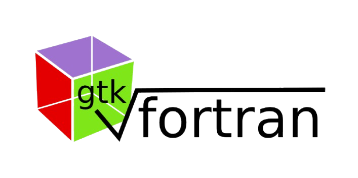

# FVisualizer

  

## ENGLISH

### Hear me out.
An application using GTK, but in FORTRAN 2018? Yes. I decided to develop this multi-OS app   
as a challenge for myself. It started as a joke among my friends, where they told me to make an   
app like "Desmos" with the most difficult programming language I know. Initially, I wanted to do this   
using C, since GTK is mostly used with it, but I made a promise. This application is still in its early stages   
of development, but I also want to implement it using an OCR written in Python, so the user   
can directly provide a photo of the equation to the algorithm and won't need to type it.

  
  

## ITALIANO
### Pensateci...
Un'applicazione con GTK, ma in FORTRAN 2018? Sì. Ho deciso di sviluppare questa app multi-OS   
come sfida personale. Tutto ciò è nato inizialmente come una sfida tra i miei amici, che mi dissero   
di fare un'applicazione simile a "Desmos" usando uno dei linguaggi di programmazione più difficili   
che conosco. Inizialmente volevo farlo in C, visto che GTK viene principalmente usato con esso, ma ho fatto una promessa.   
Questa applicazione è ancora nelle sue prime fasi di sviluppo, e la sua versione definitiva   
sicuramente implementerà anche un OCR scritto in Python, così l'utente potrà inserire direttamente una foto dell'   
equazione, senza doverla scrivere.
